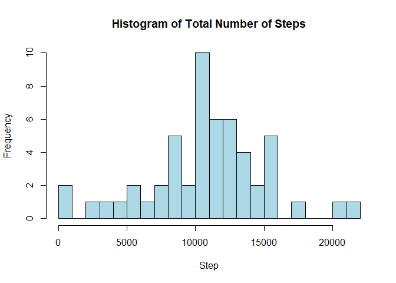
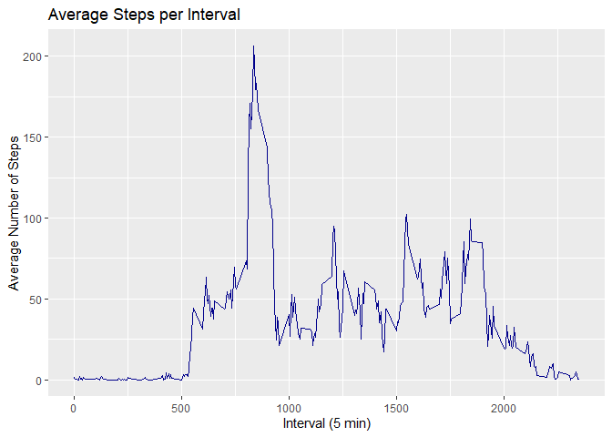
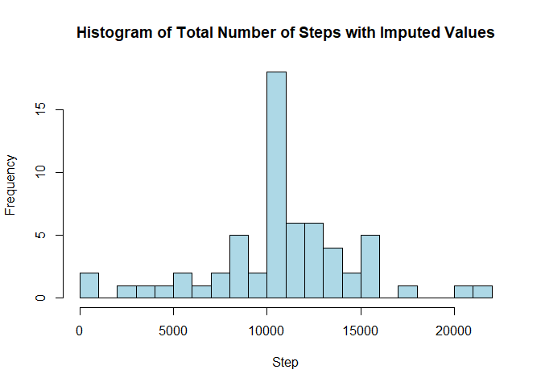
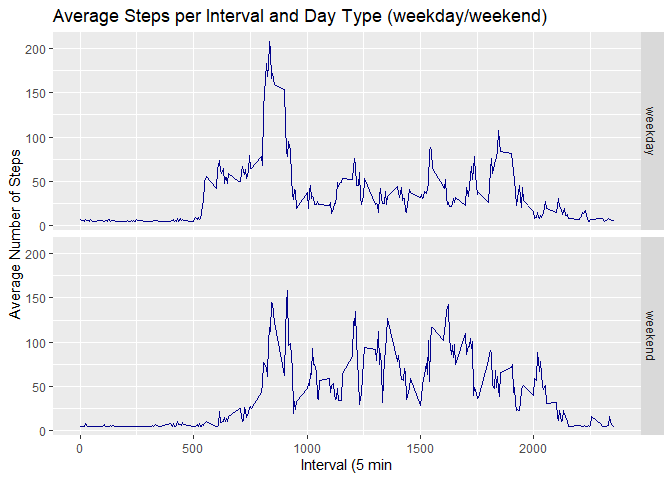

## Loading and preprocessing the data

**1. Load: use the read.csv function to load the data and store it into a data frame**

```r
dataRaw <- read.csv("C:/Users/lzijden/OneDrive - Zanders BV/Documenten/Data Science/Course 5/Week 2/repdata_data_activity/activity.csv", sep = ",", na.strings = "NA")
```

**2. Process: create new data frame and convert the character string format of date to date format using the as.Date function and store it in the new data frame**

```r
stepsPerInterval <- dataRaw
stepsPerInterval$date <- as.Date(stepsPerInterval$date)
```

## What is mean total number of steps taken per day?

**1. Calculate total steps per day: use the group_by and summarise functions of the dplyr package to sum the steps per date and store into a new data frame**

```r
stepsPerDay <- stepsPerInterval %>%
      na.omit() %>%
      group_by(date) %>%
      summarise(Steps = sum(steps))
```

```
## `summarise()` ungrouping output (override with `.groups` argument)
```

```r
stepsPerDay <- as.data.frame(stepsPerDay)
```

**2. Construct the histogram of the steps per day**

```r
hist(stepsPerDay$Steps, 
      main = "Histogram of Total Number of Steps",
      breaks = 25,
      col = "light blue",
      xlab = "Step")
```

<!-- -->

**3. Calculate the mean and median total number of steps taken per day**

```r
meanStepsPerDay <- mean(x = stepsPerDay$Steps, na.rm = TRUE)
medianStepsPerDay <- median(x = stepsPerDay$Steps, na.rm = TRUE)
meanStepsPerDay
```

```
## [1] 10766.19
```

```r
medianStepsPerDay
```

```
## [1] 10765
```

## What is the average daily activity pattern?

**1a. Use the group_by and summarise functions of the dplyr package to calculate the average steps per interval and store into a new data frame**

```r
avStepsPerInt <- stepsPerInterval %>%
    na.omit() %>%
    group_by(interval) %>%
    summarise(Steps = mean(steps))
```

```
## `summarise()` ungrouping output (override with `.groups` argument)
```

```r
avStepsPerInt <- as.data.frame(avStepsPerInt)
```

**1b. Make a time series plot using ggplot2 package**

```r
ggplot(data = avStepsPerInt,
      aes(
            x = interval, 
            y = Steps)) +
      geom_line(
            color = "dark blue",
            size = 0.4) +
      xlab("Interval (5 min)") +
      ylab("Average Number of Steps") +
      ggtitle("Average Steps per Interval")
```

<!-- -->

**2. Determine 5-minute interval that on average across all the days in the dataset contains the maximum number of steps**

```r
avStepsPerInt$interval[which.max(avStepsPerInt$Steps)]
```

```
## [1] 835
```

## Imputing missing values

**1. Calculate and report the total number of missing values in the dataset**

```r
sum(is.na(stepsPerInterval$steps))
```

```
## [1] 2304
```

**2. Devise a strategy for filling in all of the missing values in the dataset**
**3. Create a new dataset that is equal to the original dataset but with the missing data filled**

```r
# Impute missing values as means by using the impute function from the Hmisc package and store in new data frame
impStepsPerInterval <- stepsPerInterval
impStepsPerInterval$steps <- impute(stepsPerInterval$steps, fun=mean)
```

**4a. Calculate total steps per day with imputed values: use the group_by and summarise functions of the dplyr package to sum the steps per date and store into a new data frame**

```r
impStepsPerDay <- impStepsPerInterval %>%
      na.omit() %>%
      group_by(date) %>%
      summarise(Steps = sum(steps))
```

```
## `summarise()` ungrouping output (override with `.groups` argument)
```

```r
impStepsPerDay <- as.data.frame(impStepsPerDay)
```

**4b. Construct the histogram of the steps per day with imputed values**

```r
hist(impStepsPerDay$Steps, 
      main = "Histogram of Total Number of Steps with Imputed Values",
      breaks = 25,
      col = "light blue",
      xlab = "Step")
```

<!-- -->

**4c. Calculate and report the mean and median total number of steps taken per day with imputed values**

```r
meanImpStepsPerDay <- mean(x = impStepsPerDay$Steps, na.rm = TRUE)
medianImpStepsPerDay <- median(x = impStepsPerDay$Steps, na.rm = TRUE)
meanImpStepsPerDay
```

```
## [1] 10766.19
```

```r
medianImpStepsPerDay
```

```
## [1] 10766.19
```

## Are there differences in activity patterns between weekdays and weekends?

**1. Create a new factor variable in the dataset with two levels – “weekday” and “weekend” indicating whether a given date is a weekday or weekend day**

```r
impStepsPerInterval$dayType <-  ifelse(as.POSIXlt(impStepsPerInterval$date)$wday %in% c(0,6), 'weekend', 'weekday')
```

**2a. Calculate the average number of steps taken per in a 5-minute interval per day type***

```r
avImpStepsPerInterval <- aggregate(steps ~ interval + dayType, data=impStepsPerInterval, mean)
```

***2b. Make a panel plot containing a time series plot of the 5-minute interval (x-axis) and the average number of steps taken, averaged across all weekday days or weekend days (y-axis)**

```r
ggplot(avImpStepsPerInterval, aes(interval, steps)) + 
      geom_line(
            color = "dark blue",
            size = 0.4) + 
      facet_grid(dayType ~ .) +
      xlab("Interval (5 min") + 
      ylab("Average Number of Steps") +
      ggtitle("Average Steps per Interval and Day Type (weekday/weekend)")
```

<!-- -->
